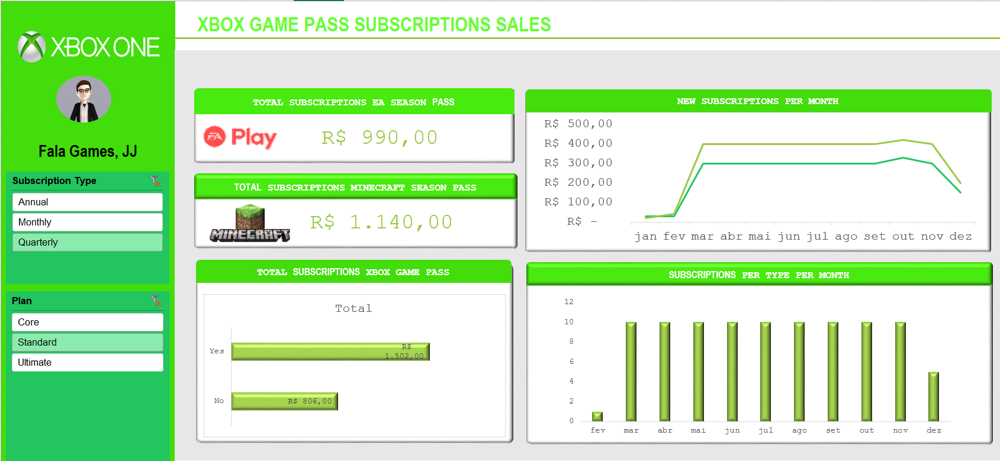

# 🎮 **Dashboard de Assinaturas do Xbox Game Pass** 📊  

Este projeto foi desenvolvido para explorar as funcionalidades do **Excel** na criação de dashboards interativos e visualmente atraentes.  

📊 **Objetivo**: Transformar dados brutos sobre assinaturas do **Xbox Game Pass** em um painel dinâmico que facilita a análise de métricas essenciais, como planos, preços e arrecadação com passes de temporada.  

---

## 🖼️ **Visualização do Dashboard**  

<p align="center">
  
</p>   

> 📌 *O dashboard apresenta uma interface intuitiva, com gráficos dinâmicos e filtros interativos para facilitar a análise.*  

---

## 🚀 **Principais Funcionalidades**  

✅ **Métricas de Destaque**  
- 💰 **Total Arrecadado**: Receita gerada pelos planos de assinatura e passes de temporada (EA Play e Minecraft).  
- 📈 **Assinaturas ao Longo do Tempo**: Gráficos que mostram a evolução das assinaturas por mês e por tipo de plano.  

🔄 **Filtros Interativos**  
- Opção de segmentação por **tipo de assinatura**:  
  - 📅 Mensal  
  - 🗓️ Anual  
  - 🔄 Trimestral  
- Diferentes **planos disponíveis**:  
  - 🟢 Core  
  - 🟦 Standard  
  - 🟣 Ultimate  

📊 **Gráficos e Análises**  
- **Evolução das assinaturas** ao longo dos meses.  
- **Comparação entre os tipos de planos** mais populares.  
- **Distribuição de assinaturas por categoria**.  

🎨 **Design e Usabilidade**  
- Interface moderna e organizada, com uso estratégico de cores e ícones.  
- Painel otimizado para leitura rápida das informações.  

---

## 🛠️ **Tecnologias Utilizadas**  

📌 **Microsoft Excel** → Manipulação de dados, criação de gráficos dinâmicos e dashboards interativos.  
📌 **Tabelas Dinâmicas** → Estruturação dos dados para facilitar a análise.  
📌 **Segmentação de Dados** → Criação de filtros interativos para explorar informações específicas.  
📌 **Formatação Condicional** → Destaque visual para facilitar a interpretação dos dados.  

---

## 📌 **Como Reproduzir Este Dashboard?**  

1️⃣ **Baixe o Arquivo do Projeto**  
   - Clone este repositório ou faça o download do arquivo Excel:  
     ```bash
     git clone https://github.com/seu-usuario/dashboard-xbox-game-pass.git
     ```  
   
2️⃣ **Abra o Arquivo no Excel**  
   - O arquivo está pronto para uso e já contém a base de dados e o dashboard configurado.  

3️⃣ **Atualize os Dados (Opcional)**  
   - Para usar com novos dados, substitua as informações na aba **"Base de Dados"**.  
   - As Tabelas Dinâmicas e os gráficos serão atualizados automaticamente.  

4️⃣ **Interaja com os Filtros**  
   - Utilize os botões de **segmentação de dados** para visualizar informações específicas.  

---

## 💡 **O que Você Aprende com Este Projeto?**  

✅ Como criar **dashboards interativos** no Excel.  
✅ Uso de **Tabelas Dinâmicas** para análise eficiente.  
✅ Aplicação de **Segmentação de Dados** para filtros dinâmicos.  
✅ Melhorias em **design e experiência do usuário** dentro do Excel.  

---

## 🔗 **Contato e Contribuição**  

📩 Tem alguma sugestão ou dúvida? Sinta-se à vontade para abrir uma *issue* ou contribuir para melhorar este projeto! 😃  

Se este projeto te ajudou, **deixe uma estrela ⭐ no repositório!**  

---

Essa versão melhora a clareza, destaca os pontos fortes do projeto e ajuda outras pessoas a entenderem e reproduzirem o dashboard. Me avise se quiser ajustes! 🚀😃# Dashboard_XBOX_JJ
